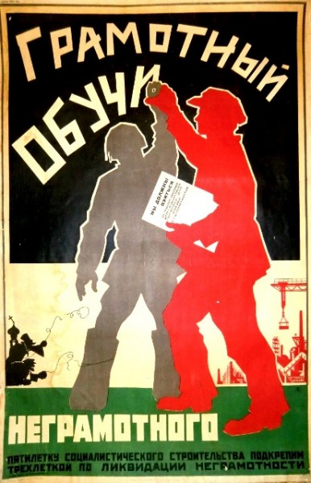

 

Иногда меня посещают мысли. Иногда по нескольку раз. Здесь я их конспектирую.
Со временем они обрастут ссылками и примерами.  

* [Код для проверки кода](linters.MD)
* [Как унять ненасытное sudo](sudo/sudo.md)
* [Чем короче зависимости, тем длиннее сон разработчика](deps/deps.md) 
* [Не вали все в один пулреквест](split/split.md) 
