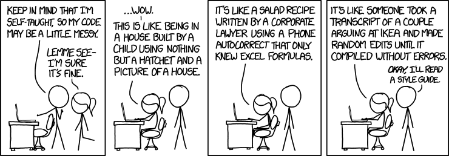

[](../README.md)



 

# Кусочек качества из коробки

## Линтеры и форматеры
Набор утилит которые при запуске изучают ваш код и находят в нем несоответствие ожиданиям.
Исторически сложилось, что и синтаксис языка и логика и форматирование проверяется вперемешку.
Есть инструменты которые только находят ошибки, а есть и те кто исправляют.

## Зачем
- Человеку свойственно ошибаться, машина может помочь найти часть ошибок.
- Можно делегировать работу машине.
- Единообразие, все пишут похожий по стилю код, в командной работе нужно быть аккуратнее с самовыражением.
- Правильно настроенные инструменты уменьшают diff, что в свою очередь делает ревью более приятным. 

## Чего не стоит ждать
- Линтеры не делают код качественным, это всего лишь один из необходимых шагов к качеству
- Не всякую ошибку инструменты могут найти
- Есть ложные срабатывания


## Когда это надо делать
Я бы сказал всегда, даже если вы пишите код для себя, все равно стоит приучать себя к аккуратности.
Да есть некоторые накладные расходы, но со временем, когда вы познакомитесь с типовыми проблемами и их решениями, это не будет занимать много времени.

В случае работы в команде, с этого стоит начать разработку.  Подключать линтеры где-то посередине разработки, это боль.

## Настраиваем процесс
Начинать надо с простого, по ходу эволюции команды улучшать.

Когда еще нет кода этого достаточно:
`Все правила линтеров обязательны, всё остальное опционально.` 
  
Второй этап выбрать и настроить линтеры. Самый простой вариант взять что-то что использовалось ранее одним из членов команды. 
Инструментов целая тьма, но в общем они примерно одинаково решают похожие задачи. Чтобы вы не выбрали - сильно не ошибётесь. 

Вот рецепт к которому пришёл я:
Линтер:
[flake8](https://pypi.org/project/flake8/) под капотом солянка из разных инструментов.
Я выбрал его за следующие фичи:
- Возможно настройки на каждый файл отдельно 
- Плагины

Вот мой начальный [набор плагинов](https://github.com/Cjkjvfnby/project_template/blob/master/%7B%7Bcookiecutter.folder_name%7D%7D/requirements-dev.txt).

Логика такая: накидать побольше плагинов, построже закрутить настройки.
А потом по ходу дела, отключать и ослаблять требования.

Для форматирования хорош black. У него мало настроек, поэтому его можно настроить быстро.

После того, как определились с инструментами надо настроить чтобы они запускались.

#### Ручной запуск
В репозитории описываем что нужно установить и как запускать инструменты руками.
Ручной запуск нужен для отладки и исправления дефектов.  

#### Полуавтоматический запуск
Можно настроить пре комит хуки. Я использую инструмент [Pre-commit](https://pre-commit.com/)
Это локальная проверка. Не все в команде её настроят у себя, да и отключить проверки для коммита не сложно.


#### Автоматический запуск
Автоматическая проверка на CI. Например GitHub Actions на каждый созданный пулреквест.


###
Если кода еще нет, то первый раз процесс займёт не более получаса. 

## Эволюция процесса
Вот появляется первый код и линтер начинает сыпать предупреждениями. Что делать?

- Исправить, если вы согласны что это ошибка.
- Отключить для определённо файла, группы файлов. Например зачем мне докстринги в тестах?
- Отключить совсем. Проекты бывают разные, не все проверки имеют смысл.
- Поставить комментарий в коде что ошибку в строке/функции/модуле игнорировать. 
  Чем меньше область отключения и точнее указанна ошибка тем лучше.
  Я вообще не люблю так делать, это загрязняет код. 
  Например можно вынести злощастный код в отдельный модуль и отключить проверку на файл. 
  Процесс творческий, для каждого случая свой подход. 
  
Вот пример моего конфига `.flake8`

```ini
[flake8]
ignore = E203, E501, W503,  # handled by black
         ANN101, ANN204
exclude =
    *_venv
    venv_*
max-complexity = 7
max-cognitive-complexity = 5
per-file-ignores =
    test/*: D10,D101,D103,S101,ANN
application-import-names = main
doctests = True
```

В свое время я внедрил flake8 в многотысячно строчный код. 
Возможность включение проверок для определённых файлов помогла работать итерациями. 
Быстро включаешь часть проверок, чтобы новые не плодились и уже проще догонять.
 
Некоторые проверки flake8 с black не совместимы.  Но подружить их можно.

### Код ревью 
С линтерами повоевали и смогли пушнуть на сервер. Теперь очередь за код ревью.
Будут попадаться моменты, которые пропущены линтером. Выбор не богатый: 
- Донастраивать линтер, если это возможно.
- Объявить новые правила, записать их и попросить всех прочитать
- принять решение, что это не важно и не парится.

## Заключение
- Автоматизируёте проверку кода, машина не заменит человеческое ревью, но сильно упростит жизнь.
- Начинайте с более строгих правил и по ходу развития проекта убирайте то, что мешает. 
- Не тратьте время и нервы на обсуждение кодстайла. Базовый набор правил делает код достаточно однообразным.
  Новые правила сильно эту картину не улучшат.
