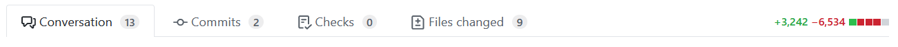
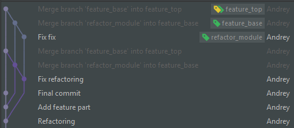

[](../README.md)

Делая пулреквест, подумай, что скажет человек, когда увидит размер твоего диффа?


Чтобы не икалось, нужно разделять изменения на части.

## Кому?
Есть best practices для работы с гитом: атомарные коммиты, хорошие сообщения к ним и так далее.
Цели этих мероприятий - помочь человеку, который будет разбираться в этом коде. 
Было ли это изменение сделано изначально? Или его внесли, когда добавляли фичу?
Или это просто опечатка при оголтелом рефакторинге?

В тот момент, когда что-то пошло не так, уже ничего нельзя изменить. 
Единственный способ предотвратить такую ситуацию - код ревью.  
Мне повезло работать в местах, где оно есть. 
Обычно для попадания кода в рабочую ветку требуется получить как минимум одно положительное ревью от других участников.

Про то что надо делать хорошо, все согласны, но по прежнему продолжают жевать крота. 
Приходишь на ревью, а там все перемешано и жёваный крот.

  
## Зачем?  
* Когда есть более 30 комментариев к куску изменений (пулреквесту) становится сложно смотреть.
  После 100 комментариев хочется убежать или вмерджить как есть.
* Люди не любят ревьюить большие пулреквесты, они их откладывают. Заходишь на кухню и у ревьюеров появляются неимоверно важные дела. 
* Одна фича блокирует мердж другой.
  Исправляем ошибку в коде (блокер) и докстрингу в другой фиче. 
  В результате мы не можем вмерджить блокер потому, что в докстринге другой фичи запятая пропущена.
* Рефакторинг можно смотреть бегло, фичи нужно смотреть внимательно.
  Рефакторинг + фичи нужно смотреть внимательно. 
  
  **Внимание метафора!**: Если добавить ложку говна в банку с вареньем,
  то получится не банка варенья с ложкой говна, а банка говна.

### Пример
Предположим у нас 300 строчек изменились, в примере я показываю только две из них.

**bad**: Всё разом. 
Тут надо смотреть внимательно, ведь в первом случае мы взяли первый аргумент, а во втором второй.
```
Change value

... 

- update(10, 20, 'hello')
+ set_status(20, 'hello')

- update(30, 40, 'word')
+ set_status(30, 'word')

...

```

 
**good**: рефакторинг отдельно, фичи отдельно

Сначала переименовали функцию. Очень легко такое ревьюить.
Отодвиньтесь от монитора, расфокусируйте глаза и проскрольте. 
Дифф выглядит как узор, вы легко заметите если что-то не так.
```
Rename function

...

- update(10, 20, 'hello')
+ set_status(10, 20, 'hello')

- update(30, 40, 'word')
+ set_status(30, 40, 'word')

...
```

Тут уже сложней, но тоже можно мельком, не вникая просмотреть все 300 изменений.
```
Remove redundant argument

...

- set_status(10, 20, 'hello')
+ set_status(10, 'hello')

- set_status(30, 40, 'word')
+ set_status(30, 'word')

...
```

А вот тут нужно смотреть внимательно. Но тут поменялась всего одна строка.
```
Enlarge value
- set_status(10, 'hello')
+ set_status(20, 'hello')
```
Чтобы найти это единственное изменение в диффе на +300-300 надо постараться.
 

## Как?

Все способы дают одинаковый результат. Они ранжированы по шкале убывания полимеров. 

### Так же как стакан воды помогает от беременности. **Вместо!**
 
Когда видите, что надо рефакторить, то вместо того, чтобы это сделать здесь и сейчас,
переключаетесь в новую ветку.
 
- `git stash` откладываем текущие изменения
- `git checkout master`, `git pull ...` получаем свежую ветку для почкования
- `git checkout -b my-refactoring-branch` создаем новую ветку для рефакторинга
- `git add ... commit ... push ... assign PR ... get a cup of tea ... merge to master`
  Делаем рефарторинг, создаем пулреквест.
  Если вы всё сделали правильно, а не переписали систему заново, 
  то получить аппрув дело пары часов, а то и минут. 
  Запрашивая ревью, не забудьте упомянуть что это рефакторинг и ревьюить там особо нечего. 
  Это сильно ускоряет процесс. 
  Потратить минутку другую перед или после похода за чашкой чая могут себе позволить почти все.    
- `git checkout my-feature-branch`
- `git stash pop`
- `git merge my-refactoring-branch # if you expect conflicts`

Если вмерджить ветку к себе, а потом в мастер через squash and merge будут конфликты. Их нужно решать руками (волшебная палочка в IDEA [решает](https://www.jetbrains.com/help/idea/resolving-conflicts.html#vcs-resolve-conflicts)).


### Прямо здесь, но отдельно
Делаем рефакторинг отдельным коммитом, продолжаем работать.
Потом аккуратно переносим в отдельную ветку.

- `git checkout master`, `git pull ...` получаем свежую ветку для почкования 
- `git checkout -b my-refactoring-branch` создаем новую ветку для рефакторинга
- `git add ... commit ... push ... assign PR ... get a cup of tea ... merge to master`
  Тот же процесс что и впредыдущем случае.

Может не работать, если коммиты не атомарны.  
Иногда можно не разделять, а попросить ревьюера посмотреть изменения отдельными коммитами. 

### Лучше поздно, чем никогда
Лучше до код ревью, чем после.

Наш любимый случай, когда все делается не до кодирования, а в процессе.
Тыщи строк уже написаны, нужно как-то на ревью отдать.

Есть у нас три фичи. Foo, Вoo и обработка и логирование ошибок. 
Foo зависит от Boo. Обработка ошибок это слой для всего приложения, нужен и для Foo и для Boo.
Если у вас нет плана и тестов, то писать фичи висящие в воздухе по отдельности не выйдет. 
Проще писать всё стразу и тестировать вместе. 

А вот настал час великого разделения.
 
Мы находимся в ветки tmp
- `git merge master` только свежие изменения! 
- `git checkout -b exceptions` создаём новую ветку и переключаемся в неё.
- `git reset master`  убираем историю коммитов, все изменения попадают в unstaged.
 
На этом шаге у нас пачка незакоммиченных изменений от последнего коммита в мастере.
Наша задача закоммитить только то, что важно для этой фичи.

Дальше вы сами по себе, я расскажу про инструменты, а в каком порядке применять решайте сами.
Ваша задача в коммит выбрать только те изменения, которые нужны. Остальные можно откатить 
либо в процессе, либо после коммита. 

Возможные действия:

- убираем ненужные изменения целыми файлами и каталогами `git revert <file_name>`
- добавляем файл и каталоги целиком `git add <file_name>` 
- откатываем/делаем правки через [IDEA](https://www.jetbrains.com/help/idea/comparing-files-and-folders.html#comparing_files)
  В удобном интерфейсе нажимам на стрелочки(>> <<) по необходимости редактируем.  
- выбираем изменения которые нужно добавить в коммит через консоль.
  `git add -i` с возможность выбора файлов или  `git add -p` для всех измененных файлов.
   Гит разобьёт дифф на кусочки и по каждому спросит, 
   что с ним делать (добавить в стейдж, не добавить, редактировать, разбить еще мельче)

В результате комбинации вы получите часть изменений в stage, часть в unstaged.

- `git commit`
- `git reset` подчищаем после себя
- ` ... cup of ...` как обычно

Вот она первая ветка. А пока она ревьюится займемся фичей Boo. 

- `git checkout tmp` возвращаемся к мегаветке
- `git merge exceptions`  на всякий случай, если там что-то поменялось
- `git checkout -b boo`
- `git reset exceptions` мы теперь работаем не от мастера 
 
Повторяем процесс экстракции ветки В.
Тут важный момент, что мы не создаём пулреквест или создаем его на мастер.
В гитхабе если сделать его на exceptions, то при закрытии пулреквеста и удалении ветки exceptions он автоматически закроется.
 
С Foo повторяем процесс почкуясь от boo.

Итого мы получаем линейную историю коммитов.

Но это не надолго, скоро подоспеют комментарии от ревьюверов.

После изменений в ветке exception нужно будет по цепочке вмерджить изменения в boo, а потом boo в foo.
Могут быть конфликты.

Если вы используете `squash and merge` при мердже exception в мастер или другие способы переписывать историю, то вас ждет мердж.  
При этом все ранее решённые конфликты придётся решать заново.

Несколько этапов ревью и постоянный мердж по цепочке ест ваше время и попортит нервы. Вишенкой на торте будут конфликтующие изменения в мастере.
 

### Фантастический
Продумываейте взаимодействие заранее. Покрывайте модули автотестами. Коммитьте их по отдельности. 
Делайте рефакторинг отдельными задачами. 

Сначала делаем обработку ошибок, покрываем её тестами и отдаём в ревью.
Код получается висящим в воздухе, так как Foo и Boo еще не существуют. Мы ходим по краю лезвия YAGNI, пишем код, который в данный момент не нужен.
В то время пока его смотрят, можно начинать работу над следующими частями. 
А в идеале планировать задачи так, чтобы сделать между ними, что-то не относящиеся к этому участку кода, чтобы дать время на прохождение ревью.


## Заключение 
Не все йогурты одинаково полезны. 
Разделение экономит время на ревью, делает всех более счастливыми и делает историю лучше, но тратит время разработчика.
Но если в момент, когда вы поняли, что кроме фичи нужно сделать что-то ещё подумайте как это разделять, это поможет значительно сократить издержки.
